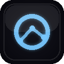

<div align="center">



# Tracked — Roblox Route Optimizer

**Akıllı sunucu seçimi, crash recovery ve gerçek zamanlı ping analizi**
**Smart server selection, crash recovery & real-time ping analytics**

[](manifest.json)
[](manifest.json)

[](https://roblox.com)
[](i18n.js)

</div>

---

## ✨ Genel Bakış

**Tracked**, Roblox kullanıcılarına _en yakın bölgesel sunucuyu_ bulma, _crash recovery_ ile aynı server'a tek tıkla geri dönme, _ping & VPN tespiti_, _canlı etkinlik bildirimleri_ ve _otomatik sunucu seçimi (auto-pilot)_ gibi gelişmiş özellikler sunan bir Chrome eklentisidir.

Roblox'un kendi web istemcisi tek bir "Play" butonuyla yetinir — Tracked, oyun deneyimini optimize etmek için **arka planda paralel sunucu tarama**, **bölgesel AWS ping ölçümü** ve **akıllı puanlama algoritmaları** çalıştırır.

> 🌍 **Dil desteği**: Türkçe (varsayılan) ve İngilizce — popup'tan/options'tan anlık değiştirilebilir.

---

## 🚀 Öne Çıkan Özellikler

### 🔄 Auto-Reconnect (Crash Recovery)
- **Crash, network drop veya ALT+F4** sonrası otomatik tespit (15-30sn içinde)
- Tema-uyumlu in-page overlay: _"Aynı Server'a Dön"_ veya _"Optimal Sunucu"_
- Roblox'un kendi "Play" butonu jobId'yi unutur — Tracked **placeId + jobId**'yi kalıcı saklar, takım arkadaşlarınla aynı server'a tek tıkla geri dönersin
- Ana sayfa, profil, avatar — _hangi Roblox sayfasında olursan ol_ overlay görünür
- Kullanıcı ayarlardan açıp kapatabilir; isteğe bağlı sistem bildirimi (default kapalı)

### 🛡️ Auto-Pilot (Akıllı Sunucu Seçici)
- **Bölgesel ping farkındalığı**: Senin AWS region pinglerini ölçüp `MAX_PING = bestRegion + 60ms` dinamik cap koyar
- Paralel `Asc + Desc` sayfalama — 2x tarama hızı
- Çoklu sayfa aday biriktirme (8+ aday) → en iyi puanı seçer (1.5sn)
- FPS sağlığı + ping cezası kombinasyonu ile yüksek kalite skor
- Tek tıkla _boş + sağlıklı + düşük ping_ sunucuya bağlanır

### 🎯 Force Join (Engelle-ve-Katıl)
- 3-aşamalı zorla-katıl motoru: hızlı tarama → pusu → sızma
- Token Bucket + AIMD rate-limit dostu polling
- **Block-flood**: Dolu sunucuları geçici olarak block list'e ekler → Roblox matchmaker'ı zorla yeni server'a yönlendirir
- 🔒 **Güvenlik garantisi**: Arkadaşlar / takipçiler / takip edilenler **ASLA** blocklanmaz
- A+B (block + new), C+D (fingerprint matching), Force Join (jobId direkt) modları

### 📡 Bölgesel Ping Ölçümü
- 5 AWS region prob (Almanya, Hollanda, Fransa, Polonya, Romanya) — özelleştirilebilir
- Ultra-stabil algoritma: warmup + median + RFC 3550 jitter hesaplama
- Best-of-N stratejisi (en düşük 3 örneğin medianı)
- 10dk persistent cache → popup hızlı açılır

### 🌐 Network Identity (VPN Tespiti)
- IP / ISP / ülke tespiti (3-provider fallback chain)
- **VPN heuristic**: tarayıcı timezone vs IP timezone karşılaştırması
- 10dk cache (önceki sürümde her açılışta network call yapıyordu — düzeltildi)

### 🎮 Canlı Etkinlik Algılama
- Game library tracking — favori oyunlarda oyuncu sayısı spike'larını izler
- Otomatik bildirim: _"X oyununda Y etkinlik başladı"_ (5dk poll)
- Aktif tab açıkken playtime sayacı

### 🛠️ Side Panel + Popup
- Modern glassmorphism UI (Apple-inspired)
- Light + dark theme
- Pin/unpin sidebar — kullanıcının çalışırken takım arkadaşlarının online durumunu görmesini sağlar
- Recent games, friends list, server scanner modal'ları

### 🌟 Sticky In-Game Bar
- Roblox oyun sayfasına injecte edilen stat bar
- 5 ana buton: Find New, Deep Scan, Force Join, C+D Targeted, Auto-Pilot
- SPA navigation watcher — Roblox'un client-side routing'inde kayboluyordu, çözüldü

---

## 📦 Kurulum

### Manuel Yükleme (Developer Mode)

1. Bu repoyu klonla veya ZIP olarak indir:
   ```bash
   git clone https://github.com/QuakeA/tracked-roblox-route-optimizer.git
   ```
2. Chrome'da `chrome://extensions/` adresine git
3. Sağ üstten **Developer mode**'u aç
4. **Load unpacked** → klonladığın klasörü seç
5. ✅ Tracked artık aktif. Roblox.com sayfasında bar otomatik gözükür.

### Chrome Web Store
> 🚧 _Yakında. Şu an manuel yükleme öneriliyor._

---

## ⚙️ Konfigürasyon

`Options` sayfasından erişilebilir özelleştirmeler:

| Kategori | Ayar | Açıklama |
|----------|------|----------|
| 🌍 **Dil** | TR / EN | Anında değişir, sayfa yenilemeye gerek yok |
| 🎨 **Görünüm** | Light/Dark, Reduced Motion | Erişilebilirlik dostu |
| 📡 **Ping Probes** | Custom AWS endpoints | Kendi region'ını ekle |
| ⏱️ **Cache** | 1-60dk | Ping sonuçları için TTL |
| 🔄 **Auto-Reconnect** | Aç/Kapa, Native bildirim | Crash recovery toggle |
| 🎯 **Force Join** | Block target, Propagation, Fingerprint, Aggressive snipe | Power user ayarları |

---

## 🏗️ Mimari

```
┌─────────────────────────────────────────────────────┐
│                  Service Worker                      │
│  ┌──────────────┐  ┌──────────────┐  ┌────────────┐ │
│  │ Auto-Reconn. │  │ Game Library │  │ Live Event │ │
│  │ Monitor      │  │ Tracker      │  │ Detector   │ │
│  └──────────────┘  └──────────────┘  └────────────┘ │
│  ┌──────────────────────────────────────────────┐   │
│  │ Background Ping Measurement (5 regions)      │   │
│  └──────────────────────────────────────────────┘   │
└─────────────────────────────────────────────────────┘
            ▲                              ▲
            │ chrome.runtime.sendMessage   │
            │                              │
┌───────────┴──────────┐    ┌─────────────┴──────────┐
│  Content Scripts     │    │  Popup / Side Panel    │
│  ┌────────────────┐  │    │  ┌──────────────────┐  │
│  │ main.js (bar)  │  │    │  │ popup.js         │  │
│  │ scanner.js     │  │    │  │ sidepanel.js     │  │
│  │ instance_      │  │    │  │ options.js       │  │
│  │   trigger.js   │  │    │  └──────────────────┘  │
│  │ reconnect_     │  │    │                        │
│  │   overlay.js   │  │    │                        │
│  └────────────────┘  │    └────────────────────────┘
└──────────────────────┘
```

**Veri akışı**:
- `chrome.storage.local` — settings, ping cache, favorites, active session, NetID cache
- `chrome.alarms` — periyodik tetikleyiciler (30sn, 1dk, 5dk, 10dk)
- `chrome.runtime.onConnect` — port-based side panel state tracking
- `chrome.scripting.executeScript({ world: 'MAIN' })` — Roblox sayfa context'inde matchmaker bypass

---

## 🛡️ Gizlilik & Güvenlik

- ✅ **Hiçbir telemetri yok** — istatistik veya kullanım verisi gönderilmez
- ✅ **Tüm veriler local** — `chrome.storage.local` (cihazda kalır)
- ✅ **3rd party API'ler**: sadece IP/ISP tespiti için ipinfo.io / ipwho.is / ipapi.co (10dk cache, opsiyonel)
- ✅ **Açık kaynak** — kodun tamamı bu repoda
- ✅ **Sosyal güvenlik**: arkadaşlar/takipçiler/takip edilenler block-flood'da **mutlak excluded**

`host_permissions` listesi `manifest.json`'da görülebilir — sadece roblox.com subdomain'leri ve gerekli yardımcı servisler.

---

## 🐛 Bilinen Sınırlamalar

- **Roblox API'sinin `ping` field'ı kullanıcı-sunucu pingi DEĞİL** — server iç sağlık metriği. "Optimal Sunucu" butonu bu yüzden Roblox'un IP-based matchmaker'ını kullanır (en güvenilir).
- **Chrome alarm minimum 30sn** — daha hızlı polling için fast-recheck timeout kombinasyonu kullanılıyor.
- **Block-flood Roblox tarafında 5 dakika** sürebilir; auto-pilot kullanım sonrası `unblockAfterJoin` mekanizması temizliği yapar.
- **Ad-blocker'lar** ipwho.is / ipapi.co'yu blokluyor — fallback chain ile ipinfo.io'ya geçiyor, sorun yok.

---

## 🧪 Test

```bash
# Syntax check
node --check service_worker.js
node --check main.js
node --check reconnect_overlay.js
# ... diğer .js dosyaları

# Manifest validation
node -e "JSON.parse(require('fs').readFileSync('manifest.json','utf8'))"
```

**Auto-Reconnect manuel test**:
```js
// Service Worker DevTools console
chrome.runtime.sendMessage({ action: 'testCrashNotification' }, console.log);
```

---

## 🛡️ Legal Notice & Copyright


**This project is private and strictly closed-source.**

> [!CAUTION]
> **Copyright © 2026 Darkzzers.** All rights reserved. 
> Any unauthorized copying, distribution, or use of this software will result in legal action. 
> All rights to this project belong solely to the developer: **Darkzzers (QuakeA)**

---

## 💬 İletişim & Destek

- 📧 **E-posta**: [slayer38tr@gmail.com](mailto:slayer38tr@gmail.com)
- ⭐ **Beğendiysen** repo'ya yıldız vermeyi unutma — projeyi destekler!

---

<div align="center">

**Roblox kullanıcıları için** 

_This project is not affiliated with Roblox Corporation._

</div>
